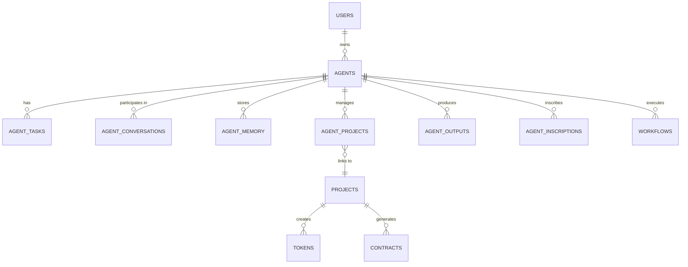
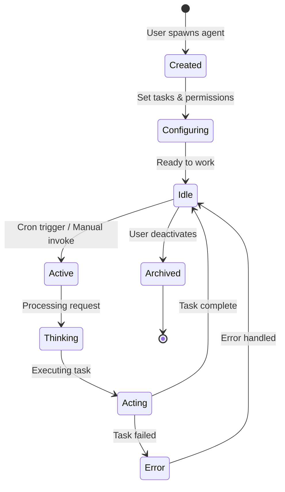

# B0ASE.COM Architectural Assessment & Product Requirements Document

**Date:** January 15, 2026
**Version:** 1.1
**Status:** ✅ APPROVED - Implementation In Progress (~60% Complete)
**Last Updated:** January 19, 2026

---

## Executive Summary

B0ase.com has reached a critical inflection point. The platform has **30+ completed features** spanning creative services, blockchain, content management, and automation. However, the **core product offering** - autonomous AI agents - has not been implemented despite running as an agent automations agency since April 2025.

**Critical Finding:** The current architecture has **agents subordinate to projects**, but the business model requires **agents at the top of the hierarchy** managing multiple projects, contracts, tokens, and workflows.

This document provides:
1. **Current State Assessment** - What we have built
2. **Architectural Gap Analysis** - What's preventing agent implementation
3. **Proposed Architecture** - Agent-first hierarchy design
4. **Product Requirements Document** - Complete specification for the agent system
5. **Implementation Roadmap** - Phased approach to re-architecture

---

## 1. CURRENT STATE ASSESSMENT

### 1.1 Platform Overview

**Tech Stack:**
- **Frontend:** Next.js 16.1.0 (App Router), React, TypeScript, Tailwind CSS, Framer Motion
- **Backend:** Next.js API Routes (500+ endpoints), Supabase (PostgreSQL + Auth + Storage)
- **Databases:** Prisma ORM (100+ models, 2,368 lines), Supabase PostgreSQL
- **Integrations:** BSV/ETH/SOL blockchains, Google AI, Grok, n8n, HandCash, Yours Wallet

**Codebase Metrics:**
- **Total Files:** 896
- **Total Tokens:** 1,743,664
- **App Directory:** 465 files (1,082,714 tokens)
- **Components:** 94 files (166,189 tokens)
- **API Routes:** 200+ endpoints
- **Pages:** 300+ pages

### 1.2 Completed Systems (30 Tasks)

#### Core Infrastructure
1. **Authentication System** - Multi-provider OAuth (Google, GitHub, Twitter, Discord, LinkedIn), wallet connections (Phantom, MetaMask, HandCash, Yours), unified user system
2. **Database Consolidation** - 100+ Prisma models, RLS policies, triggers
3. **Content Management** - Blog system, video uploads (Supabase Storage, 5GB per file), content assets API
4. **Payment System** - 1/3-1/3-1/3 payment structure, token minting, balances

#### Product Features
5. **Dashboard System** - 11 modules (fundraising, auto-book, marketing-plan, business-plan, projections, schematics, agents, servers, database, automations, messages)
6. **Portfolio System** - Demo page, holdings display, project showcase
7. **Token Launch Platform** - /mint pages, investment tracking, shareholder management
8. **Automation Packages** - 3 tiers (Starter £297/mo, Professional £597/mo, Enterprise £1,497/mo) with detail pages and checkout flow
9. **Contract System** - 4 professional templates (Service Agreement, NDA, AI Development Rider, IP Transfer) with edit mode, BSV blockchain placeholders
10. **Brand Assets Backend** - Upload API, color palette management, database schema (4 logo types, 5 colors)
11. **Blog Ideas Bucket** - Full CRUD system with API endpoints, admin UI, tags, notes, 'used' tracking for auto-blog generation
12. **Style Guide** - Comprehensive documentation of house style, layout principles, typography, colors

#### Documentation
13. **Codebase Map** - Cartographer-generated (Jan 14, 2026), 896 files documented
14. **Agentic Workforce Strategy** - 100+ person AI company design, 7 divisions, specialized skills
15. **Multiple Guides** - Auth system, deployment, N8N integration, performance optimization, testing, monitoring

### 1.3 Current Architectural Patterns

**Route Structure:**
```
/                       # Landing page
/dashboard/*            # 11 system modules
/user/account           # Tabbed interface (18 tabs)
/services               # Service catalog
/automation             # Package offerings
/mint                   # Token launches
/boardroom              # DAO governance
/portfolio              # Portfolio showcase
/blog                   # Blog system
/projects/*             # Project management
/agents/*               # Agent pages (INCOMPLETE)
/admin/*                # Admin operations
/api/*                  # 500+ API endpoints
```

**Data Hierarchy (Current - PROBLEMATIC):**
```
Users
  └── Projects
        ├── Project Members
        ├── Project Features
        └── Agents (attached to projects)
              └── AI Agent Config
```

**Authentication Flow:**
```
User → Multi-Provider Auth → Unified Users → Linked Identities → Roles
```

### 1.4 What's Missing (Critical Gap)

**PRIMARY GAPS:**

1. **No Working /agent Chat Interface**
   - Listed in navigation but not functional
   - No real-time conversation system
   - No Claude/GPT API integration for autonomous agents
   - No conversation history storage

2. **No Agent Management System**
   - No agent spawning interface at /dashboard/agents
   - No agent task assignment
   - No cron job scheduling for agents
   - No agent-to-project linkage system
   - No multi-project agent support

3. **Inverted Architecture**
   - Current: Projects → Agents
   - Required: Agents → Projects, Contracts, Tokens, Workflows
   - Agents cannot create or manage downstream resources
   - Agents locked to single projects

4. **No Agent Backend**
   - No conversation tracking database
   - No agent memory system
   - No BSV blockchain inscription for agent interactions
   - No agent performance metrics

---

## 2. ARCHITECTURAL GAP ANALYSIS

### 2.1 Current vs. Required Hierarchy

**CURRENT HIERARCHY (Problematic):**
```
┌─────────┐
│  Users  │
└────┬────┘
     │
┌────▼────────┐
│  Projects   │ ◄── Too high in hierarchy
└────┬────────┘
     │
┌────▼──────────┐
│    Agents     │ ◄── Should be at top
└───────────────┘
```

**REQUIRED HIERARCHY (Agent-First):**
```
┌──────────┐
│  Agents  │ ◄── Top of hierarchy
└────┬─────┘
     │
     ├──────────┐
     │          │
┌────▼─────┐ ┌─▼──────────┐
│ Projects │ │ Workflows  │
└────┬─────┘ └─┬──────────┘
     │         │
     ├─────────┼────────────┐
     │         │            │
┌────▼──┐ ┌───▼──────┐ ┌───▼─────┐
│Tokens │ │Contracts │ │ Content │
└───────┘ └──────────┘ └─────────┘
```

### 2.2 Database Schema Gaps

**Current `ai_agent_config` Table (Insufficient):**
```sql
model ai_agent_config {
  id          String
  user_id     String?
  config_type String
  provider    String?
  config_data Json
  is_active   Boolean?
  created_at  DateTime?
  updated_at  DateTime?
}
```

**Problems:**
- No agent identity or name
- No task/cron job storage
- No project relationship
- No conversation history
- No performance metrics
- No memory/RAG system
- Generic JSON blob for config (not queryable)

**Required Tables:**
```
agents                  # Core agent identities
agent_tasks             # Cron jobs & task definitions
agent_conversations     # Chat history
agent_memory            # Long-term memory/RAG
agent_projects          # Many-to-many agent↔project
agent_performance       # Metrics & analytics
agent_outputs           # Work products
agent_inscriptions      # BSV blockchain records
```

### 2.3 API Endpoint Gaps

**Missing Critical Endpoints:**
```
POST   /api/agents/create              # Spawn new agent
POST   /api/agents/[id]/chat           # Real-time chat
GET    /api/agents/[id]/tasks          # Get agent tasks
POST   /api/agents/[id]/tasks          # Assign task
PATCH  /api/agents/[id]/tasks/[taskId] # Update task
GET    /api/agents/[id]/conversations  # Get chat history
POST   /api/agents/[id]/projects       # Link to project
DELETE /api/agents/[id]/projects/[pid] # Unlink project
GET    /api/agents/[id]/performance    # Get metrics
POST   /api/agents/[id]/inscribe       # BSV inscription
```

### 2.4 UI Component Gaps

**Missing Components:**
- AgentChatInterface (real-time messaging)
- AgentSpawner (creation wizard)
- AgentTaskManager (cron job scheduler)
- AgentProjectLinker (multi-project assignment)
- AgentPerformanceDashboard (analytics)
- AgentMemoryViewer (RAG system browser)
- ConversationHistory (chat log)
- AgentSelector (choose agent for task)

---

## 3. STRATEGIC QUESTIONS & DECISIONS

### 3.1 Fundamental Architecture Decisions

**Decision 1: Agent Hierarchy Position**
- **Current:** Agents subordinate to projects
- **Required:** Agents at top of hierarchy
- **Impact:** CRITICAL - requires database refactor
- **Recommendation:** ✅ APPROVE - Essential for business model

**Decision 2: Agent Autonomy Level**
- **Option A:** Fully autonomous (agents create/manage resources)
- **Option B:** Semi-autonomous (agents recommend, humans approve)
- **Option C:** Assisted (agents execute assigned tasks only)
- **Recommendation:** Start with B, evolve to A

**Decision 3: Multi-Tenancy Model**
- **Option A:** Agents belong to users (private workforce)
- **Option B:** Shared agent pool (platform-wide)
- **Option C:** Hybrid (personal + shared agents)
- **Recommendation:** Option A for MVP, add C later

**Decision 4: Conversation Storage**
- **Option A:** PostgreSQL (queryable, searchable)
- **Option B:** BSV blockchain (immutable, permanent)
- **Option C:** Hybrid (PostgreSQL + BSV inscription)
- **Recommendation:** Option C for full auditability

### 3.2 Integration Priorities

**Tier 1 (Must Have):**
- Claude API (primary AI provider)
- OpenAI API (fallback)
- Supabase (database, auth, storage)
- n8n (workflow automation)

**Tier 2 (Important):**
- Twitter API (auto-posting)
- BSV blockchain (inscriptions)
- GitHub API (repo tokenization)
- Calendar APIs (scheduling)

**Tier 3 (Nice to Have):**
- Spotify API (music automation)
- Stripe API (payment processing)
- Discord API (community management)
- Notion API (content sync)

---

## 4. PROPOSED ARCHITECTURE

### 4.1 Agent-First Data Model



### 4.2 Core Agent System Architecture

```mermaid
graph TB
    subgraph "Frontend Layer"
        Chat[Agent Chat UI]
        Spawner[Agent Spawner]
        Manager[Agent Manager]
        Dashboard[Agent Dashboard]
    end

    subgraph "API Layer"
        ChatAPI[/api/agents/[id]/chat]
        CreateAPI[/api/agents/create]
        TaskAPI[/api/agents/[id]/tasks]
        ConversationAPI[/api/agents/[id]/conversations]
    end

    subgraph "Agent Engine"
        Router[Request Router]
        Claude[Claude API Client]
        Memory[RAG Memory System]
        Executor[Task Executor]
        Scheduler[Cron Scheduler]
    end

    subgraph "Data Layer"
        AgentDB[(agents)]
        TaskDB[(agent_tasks)]
        ConvDB[(agent_conversations)]
        MemDB[(agent_memory)]
        ProjectDB[(agent_projects)]
    end

    subgraph "External Services"
        BSV[BSV Blockchain]
        N8N[n8n Workflows]
        Twitter[Twitter API]
        GitHub[GitHub API]
    end

    Chat --> ChatAPI
    Spawner --> CreateAPI
    Manager --> TaskAPI
    Dashboard --> ConversationAPI

    ChatAPI --> Router
    CreateAPI --> Router
    TaskAPI --> Router
    ConversationAPI --> Router

    Router --> Claude
    Router --> Memory
    Router --> Executor
    Router --> Scheduler

    Claude --> ConvDB
    Memory --> MemDB
    Executor --> TaskDB
    Scheduler --> TaskDB

    Executor --> N8N
    Executor --> Twitter
    Executor --> GitHub

    Claude --> BSV
```

### 4.3 Agent Lifecycle



---

## 5. PRODUCT REQUIREMENTS DOCUMENT

### 5.1 Core Features

#### Feature 1: Agent Chat Interface (`/agent`)

**User Story:** As a user, I want to chat with an AI agent in real-time so that I can get help with tasks, projects, and workflows.

**Acceptance Criteria:**
- [ ] Real-time chat interface with message input
- [ ] Conversation history persists across sessions
- [ ] Agent typing indicators
- [ ] Code block rendering with syntax highlighting
- [ ] File attachment support (images, documents)
- [ ] Conversation export (markdown, JSON)
- [ ] Claude API integration for responses
- [ ] Message threading support
- [ ] Mobile-responsive design

**Technical Requirements:**
- WebSocket or Server-Sent Events for real-time updates
- Conversation stored in `agent_conversations` table
- RAG memory system for context
- Token usage tracking
- Rate limiting (prevent abuse)

**UI Mockup:**
```
┌─────────────────────────────────────┐
│  Agent Chat                    [X]  │
├─────────────────────────────────────┤
│ [Agent Avatar] Claude Assistant     │
│ Status: ● Online                    │
├─────────────────────────────────────┤
│                                     │
│  User: Can you help me create a    │
│        new token for my project?    │
│                                     │
│  Agent: Of course! I'll help you   │
│         create a token. Let me      │
│         ask a few questions...      │
│                                     │
│  [More messages...]                 │
│                                     │
│                                     │
├─────────────────────────────────────┤
│ [📎] [Type message...]      [Send ↑]│
└─────────────────────────────────────┘
```

#### Feature 2: Agent Spawner (`/dashboard/agents`)

**User Story:** As a user, I want to create new AI agents with specific roles and tasks so that I can automate different parts of my business.

**Acceptance Criteria:**
- [ ] Agent creation wizard with step-by-step flow
- [ ] Agent naming and description
- [ ] Agent role selection (Developer, Marketer, Support, Custom)
- [ ] Task assignment during creation
- [ ] Cron schedule configuration
- [ ] Project linkage (optional, can be added later)
- [ ] Social account linkage
- [ ] Agent preview before creation
- [ ] Bulk agent creation

**Technical Requirements:**
- Create agent record in `agents` table
- Initialize default tasks based on role
- Setup cron jobs in system
- Generate unique agent ID
- Set default AI model (Claude Sonnet 4.5)
- Initialize empty memory/RAG system

**UI Mockup:**
```
┌─────────────────────────────────────────┐
│  Create New Agent                       │
├─────────────────────────────────────────┤
│                                         │
│  Step 1: Basic Info                     │
│  ┌───────────────────────────────────┐  │
│  │ Name: Marketing Agent             │  │
│  │ Description: Auto-posts to Twitter│  │
│  └───────────────────────────────────┘  │
│                                         │
│  Step 2: Role Selection                 │
│  ○ Developer  ● Marketer  ○ Support    │
│  ○ Content Creator  ○ Custom            │
│                                         │
│  Step 3: Tasks (Optional)               │
│  [+ Add Task]                           │
│  ☑ Post to Twitter daily at 9am         │
│  ☐ Generate blog content weekly         │
│                                         │
│  Step 4: Link Projects (Optional)       │
│  [+ Link Project]                       │
│  □ ProjectA  □ ProjectB  □ ProjectC     │
│                                         │
│  [Cancel]              [Create Agent →] │
└─────────────────────────────────────────┘
```

#### Feature 3: Agent Task Manager

**User Story:** As a user, I want to assign tasks and cron jobs to my agents so that they can work autonomously.

**Acceptance Criteria:**
- [ ] View all tasks for an agent
- [ ] Add new task with cron schedule
- [ ] Edit existing task
- [ ] Enable/disable tasks
- [ ] Delete tasks
- [ ] View task execution history
- [ ] See next scheduled run time
- [ ] Manual task trigger
- [ ] Task template library

**Technical Requirements:**
- CRUD operations on `agent_tasks` table
- Cron syntax validation
- Next.js API routes for task management
- Integration with scheduler (node-cron or similar)
- Task execution logs
- Error handling and retries

#### Feature 4: Multi-Project Agent Assignment

**User Story:** As a user, I want to assign a single agent to multiple projects so that the agent can manage different workstreams.

**Acceptance Criteria:**
- [ ] View projects linked to agent
- [ ] Add project to agent
- [ ] Remove project from agent
- [ ] Set project-specific permissions
- [ ] See agent workload across projects
- [ ] Filter agent actions by project

**Technical Requirements:**
- Many-to-many relationship via `agent_projects` table
- Project permissions system
- Agent workload calculation
- Project context switching in conversations

#### Feature 5: Agent Performance Dashboard

**User Story:** As a user, I want to see how my agents are performing so that I can optimize their effectiveness.

**Acceptance Criteria:**
- [ ] Tasks completed count
- [ ] Success rate percentage
- [ ] Average response time
- [ ] Token usage metrics
- [ ] Cost tracking
- [ ] Error rate
- [ ] Most active agents
- [ ] Performance trends over time

**Technical Requirements:**
- `agent_performance` table
- Analytics aggregation queries
- Chart components (Chart.js or Recharts)
- Real-time metrics updates
- Export performance reports

### 5.2 Database Schema (Complete)

**See Section 6.2 for full SQL schema.**

### 5.3 API Specification

**See Section 6.3 for complete API documentation.**

---

## 6. IMPLEMENTATION SPECIFICATION

### 6.1 Technology Decisions

**AI Provider:**
- **Primary:** Claude (Anthropic API) - Sonnet 4.5
- **Fallback:** OpenAI (GPT-4)
- **Reason:** Claude has longer context, better code generation, and aligns with agentic use cases

**Real-Time Communication:**
- **Option:** Server-Sent Events (SSE)
- **Reason:** Simpler than WebSockets for one-way streaming, works with Next.js API routes

**Cron Scheduler:**
- **Option:** node-cron (in-process) for MVP, Vercel Cron (production)
- **Reason:** Simple to implement, scales with Vercel infrastructure

**Memory/RAG System:**
- **Option:** PostgreSQL vector extension (pgvector)
- **Reason:** Already using PostgreSQL, avoids additional service

### 6.2 Database Schema (Complete SQL)

```sql
-- Core Agents Table
CREATE TABLE agents (
  id UUID PRIMARY KEY DEFAULT gen_random_uuid(),
  user_id UUID REFERENCES auth.users(id) ON DELETE CASCADE NOT NULL,

  -- Agent Identity
  name VARCHAR(100) NOT NULL,
  description TEXT,
  role VARCHAR(50) NOT NULL, -- 'developer', 'marketer', 'support', 'content', 'custom'
  avatar_url TEXT,

  -- AI Configuration
  ai_provider VARCHAR(50) DEFAULT 'claude', -- 'claude', 'openai', 'grok'
  ai_model VARCHAR(100) DEFAULT 'claude-sonnet-4-5',
  temperature DECIMAL(3,2) DEFAULT 0.7,
  max_tokens INT DEFAULT 4096,
  system_prompt TEXT,

  -- Status
  is_active BOOLEAN DEFAULT true,
  is_deployed BOOLEAN DEFAULT false,
  deployment_url TEXT,

  -- Metadata
  created_at TIMESTAMPTZ DEFAULT NOW(),
  updated_at TIMESTAMPTZ DEFAULT NOW(),
  last_active_at TIMESTAMPTZ,

  -- Constraints
  CONSTRAINT valid_role CHECK (role IN ('developer', 'marketer', 'support', 'content', 'custom')),
  CONSTRAINT valid_temperature CHECK (temperature >= 0 AND temperature <= 2)
);

-- Agent Tasks (Cron Jobs)
CREATE TABLE agent_tasks (
  id UUID PRIMARY KEY DEFAULT gen_random_uuid(),
  agent_id UUID REFERENCES agents(id) ON DELETE CASCADE NOT NULL,

  -- Task Definition
  task_name VARCHAR(200) NOT NULL,
  task_description TEXT,
  task_type VARCHAR(50) NOT NULL, -- 'cron', 'webhook', 'manual'

  -- Scheduling
  cron_expression VARCHAR(100), -- e.g., '0 9 * * *' (daily at 9am)
  next_run_at TIMESTAMPTZ,
  last_run_at TIMESTAMPTZ,

  -- Configuration
  task_config JSONB, -- Flexible task-specific settings
  priority INT DEFAULT 5, -- 1 (highest) to 10 (lowest)
  retry_count INT DEFAULT 3,
  timeout_seconds INT DEFAULT 300,

  -- Status
  is_enabled BOOLEAN DEFAULT true,
  execution_count INT DEFAULT 0,
  success_count INT DEFAULT 0,
  failure_count INT DEFAULT 0,

  -- Metadata
  created_at TIMESTAMPTZ DEFAULT NOW(),
  updated_at TIMESTAMPTZ DEFAULT NOW()
);

-- Agent Conversations
CREATE TABLE agent_conversations (
  id UUID PRIMARY KEY DEFAULT gen_random_uuid(),
  agent_id UUID REFERENCES agents(id) ON DELETE CASCADE NOT NULL,
  user_id UUID REFERENCES auth.users(id) ON DELETE CASCADE NOT NULL,

  -- Conversation Metadata
  title VARCHAR(200),
  status VARCHAR(50) DEFAULT 'active', -- 'active', 'archived', 'deleted'

  -- Timestamps
  created_at TIMESTAMPTZ DEFAULT NOW(),
  updated_at TIMESTAMPTZ DEFAULT NOW(),
  last_message_at TIMESTAMPTZ
);

-- Conversation Messages
CREATE TABLE conversation_messages (
  id UUID PRIMARY KEY DEFAULT gen_random_uuid(),
  conversation_id UUID REFERENCES agent_conversations(id) ON DELETE CASCADE NOT NULL,

  -- Message Data
  role VARCHAR(20) NOT NULL, -- 'user', 'assistant', 'system'
  content TEXT NOT NULL,
  attachments JSONB, -- File URLs, images, etc.

  -- Metadata
  tokens_used INT,
  model_used VARCHAR(100),
  cost_usd DECIMAL(10,6),

  -- Timestamps
  created_at TIMESTAMPTZ DEFAULT NOW(),

  -- Constraints
  CONSTRAINT valid_role CHECK (role IN ('user', 'assistant', 'system'))
);

-- Agent Memory (RAG System)
CREATE TABLE agent_memory (
  id UUID PRIMARY KEY DEFAULT gen_random_uuid(),
  agent_id UUID REFERENCES agents(id) ON DELETE CASCADE NOT NULL,

  -- Memory Content
  content TEXT NOT NULL,
  embedding VECTOR(1536), -- OpenAI embedding dimension
  memory_type VARCHAR(50), -- 'fact', 'procedure', 'example', 'context'

  -- Source
  source_conversation_id UUID REFERENCES agent_conversations(id),
  source_url TEXT,

  -- Metadata
  importance_score DECIMAL(3,2) DEFAULT 0.5, -- 0 to 1
  access_count INT DEFAULT 0,
  last_accessed_at TIMESTAMPTZ,

  -- Timestamps
  created_at TIMESTAMPTZ DEFAULT NOW(),
  updated_at TIMESTAMPTZ DEFAULT NOW()
);

-- Agent Projects (Many-to-Many)
CREATE TABLE agent_projects (
  id UUID PRIMARY KEY DEFAULT gen_random_uuid(),
  agent_id UUID REFERENCES agents(id) ON DELETE CASCADE NOT NULL,
  project_id UUID REFERENCES projects(id) ON DELETE CASCADE NOT NULL,

  -- Permissions
  can_read BOOLEAN DEFAULT true,
  can_write BOOLEAN DEFAULT false,
  can_deploy BOOLEAN DEFAULT false,

  -- Status
  is_active BOOLEAN DEFAULT true,

  -- Timestamps
  created_at TIMESTAMPTZ DEFAULT NOW(),
  updated_at TIMESTAMPTZ DEFAULT NOW(),

  -- Constraints
  UNIQUE(agent_id, project_id)
);

-- Agent Performance Metrics
CREATE TABLE agent_performance (
  id UUID PRIMARY KEY DEFAULT gen_random_uuid(),
  agent_id UUID REFERENCES agents(id) ON DELETE CASCADE NOT NULL,

  -- Time Period
  period_start TIMESTAMPTZ NOT NULL,
  period_end TIMESTAMPTZ NOT NULL,

  -- Metrics
  tasks_completed INT DEFAULT 0,
  tasks_failed INT DEFAULT 0,
  total_tokens_used INT DEFAULT 0,
  total_cost_usd DECIMAL(10,2) DEFAULT 0,
  avg_response_time_ms INT,

  -- Quality Metrics
  user_satisfaction_score DECIMAL(3,2), -- 0 to 5
  error_rate DECIMAL(5,2), -- Percentage

  -- Timestamps
  created_at TIMESTAMPTZ DEFAULT NOW()
);

-- Agent Outputs (Work Products)
CREATE TABLE agent_outputs (
  id UUID PRIMARY KEY DEFAULT gen_random_uuid(),
  agent_id UUID REFERENCES agents(id) ON DELETE CASCADE NOT NULL,
  task_id UUID REFERENCES agent_tasks(id) ON DELETE SET NULL,

  -- Output Data
  output_type VARCHAR(50), -- 'blog_post', 'code', 'contract', 'token', 'tweet', etc.
  content TEXT,
  metadata JSONB,

  -- Status
  status VARCHAR(50) DEFAULT 'draft', -- 'draft', 'pending_review', 'approved', 'published'

  -- Timestamps
  created_at TIMESTAMPTZ DEFAULT NOW(),
  updated_at TIMESTAMPTZ DEFAULT NOW(),
  published_at TIMESTAMPTZ
);

-- BSV Blockchain Inscriptions
CREATE TABLE agent_inscriptions (
  id UUID PRIMARY KEY DEFAULT gen_random_uuid(),
  agent_id UUID REFERENCES agents(id) ON DELETE CASCADE NOT NULL,
  conversation_id UUID REFERENCES agent_conversations(id),
  output_id UUID REFERENCES agent_outputs(id),

  -- Inscription Data
  inscription_id VARCHAR(100) UNIQUE,
  transaction_id VARCHAR(100),
  content_hash VARCHAR(100),
  inscription_url TEXT,

  -- Metadata
  inscription_type VARCHAR(50), -- 'conversation', 'output', 'contract', etc.

  -- Timestamps
  created_at TIMESTAMPTZ DEFAULT NOW()
);

-- Indexes for Performance
CREATE INDEX idx_agents_user_id ON agents(user_id);
CREATE INDEX idx_agents_role ON agents(role);
CREATE INDEX idx_agent_tasks_agent_id ON agent_tasks(agent_id);
CREATE INDEX idx_agent_tasks_next_run ON agent_tasks(next_run_at) WHERE is_enabled = true;
CREATE INDEX idx_agent_conversations_agent_id ON agent_conversations(agent_id);
CREATE INDEX idx_agent_conversations_user_id ON agent_conversations(user_id);
CREATE INDEX idx_conversation_messages_conversation_id ON conversation_messages(conversation_id);
CREATE INDEX idx_agent_memory_agent_id ON agent_memory(agent_id);
CREATE INDEX idx_agent_projects_agent_id ON agent_projects(agent_id);
CREATE INDEX idx_agent_projects_project_id ON agent_projects(project_id);
CREATE INDEX idx_agent_performance_agent_id ON agent_performance(agent_id);
CREATE INDEX idx_agent_outputs_agent_id ON agent_outputs(agent_id);
CREATE INDEX idx_agent_inscriptions_agent_id ON agent_inscriptions(agent_id);

-- Enable Row Level Security
ALTER TABLE agents ENABLE ROW LEVEL SECURITY;
ALTER TABLE agent_tasks ENABLE ROW LEVEL SECURITY;
ALTER TABLE agent_conversations ENABLE ROW LEVEL SECURITY;
ALTER TABLE conversation_messages ENABLE ROW LEVEL SECURITY;
ALTER TABLE agent_memory ENABLE ROW LEVEL SECURITY;
ALTER TABLE agent_projects ENABLE ROW LEVEL SECURITY;
ALTER TABLE agent_performance ENABLE ROW LEVEL SECURITY;
ALTER TABLE agent_outputs ENABLE ROW LEVEL SECURITY;
ALTER TABLE agent_inscriptions ENABLE ROW LEVEL SECURITY;

-- RLS Policies (Users can only access their own agents)
CREATE POLICY "Users can view their own agents"
  ON agents FOR SELECT
  USING (auth.uid() = user_id);

CREATE POLICY "Users can insert their own agents"
  ON agents FOR INSERT
  WITH CHECK (auth.uid() = user_id);

CREATE POLICY "Users can update their own agents"
  ON agents FOR UPDATE
  USING (auth.uid() = user_id);

CREATE POLICY "Users can delete their own agents"
  ON agents FOR DELETE
  USING (auth.uid() = user_id);

-- Similar policies for other tables...
```

### 6.3 API Endpoints (Complete Specification)

**Agent Management:**

```typescript
// Create Agent
POST /api/agents/create
Body: {
  name: string
  description?: string
  role: 'developer' | 'marketer' | 'support' | 'content' | 'custom'
  ai_provider?: 'claude' | 'openai' | 'grok'
  ai_model?: string
  system_prompt?: string
}
Response: { success: true, agent: Agent }

// Get All Agents
GET /api/agents
Response: { agents: Agent[] }

// Get Single Agent
GET /api/agents/[id]
Response: { agent: Agent }

// Update Agent
PATCH /api/agents/[id]
Body: Partial<Agent>
Response: { success: true, agent: Agent }

// Delete Agent
DELETE /api/agents/[id]
Response: { success: true }

// Deploy Agent
POST /api/agents/[id]/deploy
Response: { success: true, deployment_url: string }
```

**Task Management:**

```typescript
// Create Task
POST /api/agents/[id]/tasks
Body: {
  task_name: string
  task_description?: string
  task_type: 'cron' | 'webhook' | 'manual'
  cron_expression?: string
  task_config?: Record<string, any>
  priority?: number
}
Response: { success: true, task: AgentTask }

// Get Tasks
GET /api/agents/[id]/tasks
Response: { tasks: AgentTask[] }

// Update Task
PATCH /api/agents/[id]/tasks/[taskId]
Body: Partial<AgentTask>
Response: { success: true, task: AgentTask }

// Enable/Disable Task
PATCH /api/agents/[id]/tasks/[taskId]/toggle
Response: { success: true, is_enabled: boolean }

// Delete Task
DELETE /api/agents/[id]/tasks/[taskId]
Response: { success: true }

// Manually Trigger Task
POST /api/agents/[id]/tasks/[taskId]/execute
Response: { success: true, execution_id: string }
```

**Chat & Conversations:**

```typescript
// Create Conversation
POST /api/agents/[id]/conversations
Body: {
  title?: string
}
Response: { success: true, conversation: Conversation }

// Get Conversations
GET /api/agents/[id]/conversations
Response: { conversations: Conversation[] }

// Get Conversation Messages
GET /api/agents/[id]/conversations/[conversationId]/messages
Response: { messages: Message[] }

// Send Message (Streaming)
POST /api/agents/[id]/conversations/[conversationId]/messages
Body: {
  content: string
  attachments?: Array<{ url: string, type: string }>
}
Response: Stream of SSE events with assistant response

// Archive Conversation
PATCH /api/agents/[id]/conversations/[conversationId]
Body: { status: 'archived' }
Response: { success: true }
```

**Project Linkage:**

```typescript
// Link Agent to Project
POST /api/agents/[id]/projects
Body: {
  project_id: string
  can_read?: boolean
  can_write?: boolean
  can_deploy?: boolean
}
Response: { success: true, link: AgentProject }

// Get Linked Projects
GET /api/agents/[id]/projects
Response: { projects: AgentProject[] }

// Unlink Project
DELETE /api/agents/[id]/projects/[projectId]
Response: { success: true }
```

**Performance & Analytics:**

```typescript
// Get Performance Metrics
GET /api/agents/[id]/performance
Query: ?period_start=ISO8601&period_end=ISO8601
Response: { metrics: AgentPerformance }

// Get Task Execution History
GET /api/agents/[id]/tasks/[taskId]/history
Query: ?limit=50&offset=0
Response: { executions: TaskExecution[] }
```

### 6.4 UI Components (React/TypeScript)

**AgentChatInterface.tsx:**
```typescript
interface AgentChatInterfaceProps {
  agentId: string
  conversationId?: string
}

export function AgentChatInterface({ agentId, conversationId }: AgentChatInterfaceProps) {
  const [messages, setMessages] = useState<Message[]>([])
  const [input, setInput] = useState('')
  const [streaming, setStreaming] = useState(false)

  const sendMessage = async () => {
    // Send message and handle SSE streaming response
  }

  return (
    <div className="chat-container">
      <div className="messages">
        {messages.map(msg => (
          <MessageBubble key={msg.id} message={msg} />
        ))}
      </div>
      <div className="input-area">
        <input
          value={input}
          onChange={(e) => setInput(e.target.value)}
          onKeyDown={(e) => e.key === 'Enter' && sendMessage()}
          disabled={streaming}
        />
        <button onClick={sendMessage} disabled={streaming}>
          Send
        </button>
      </div>
    </div>
  )
}
```

**AgentSpawner.tsx:**
```typescript
export function AgentSpawner() {
  const [step, setStep] = useState(1)
  const [formData, setFormData] = useState({
    name: '',
    description: '',
    role: 'custom',
    tasks: [],
    projects: []
  })

  const createAgent = async () => {
    const response = await fetch('/api/agents/create', {
      method: 'POST',
      headers: { 'Content-Type': 'application/json' },
      body: JSON.stringify(formData)
    })
    // Handle response
  }

  return (
    <div className="spawner-wizard">
      {step === 1 && <BasicInfoStep />}
      {step === 2 && <RoleSelectionStep />}
      {step === 3 && <TaskAssignmentStep />}
      {step === 4 && <ProjectLinkageStep />}
      <div className="navigation">
        <button onClick={() => setStep(step - 1)}>Back</button>
        {step < 4 ? (
          <button onClick={() => setStep(step + 1)}>Next</button>
        ) : (
          <button onClick={createAgent}>Create Agent</button>
        )}
      </div>
    </div>
  )
}
```

---

## 7. IMPLEMENTATION ROADMAP

### Phase 0: Foundation (Week 1) ✅ COMPLETE
**Goal:** Database schema and core API infrastructure

**Tasks:**
- [x] Execute database migration (agents table + related tables)
- [x] Setup RLS policies
- [x] Create base API route structure
- [x] Install dependencies (Anthropic SDK, node-cron)
- [x] Configure environment variables

**Deliverables:**
- ✅ Complete database schema deployed (8 agent tables in Prisma)
- ✅ API route scaffolding (15 endpoints)
- ✅ Environment setup documentation

### Phase 1: Agent Chat (Weeks 2-3) ✅ COMPLETE
**Goal:** Working `/agent` page with real-time chat

**Tasks:**
- [x] Build AgentChatInterface component
- [x] Implement POST /api/agents/[id]/chat endpoint
- [x] Setup Claude API integration
- [x] Add SSE streaming for responses
- [x] Create conversation storage system
- [x] Add conversation history UI
- [x] Implement message persistence

**Deliverables:**
- ✅ Functional chat interface at /agent (787 lines)
- ✅ Real-time AI responses via Claude (SSE streaming)
- ✅ Conversation history (stored in conversation_messages table)

### Phase 2: Agent Management (Weeks 4-5) ⚠️ PARTIAL
**Goal:** `/dashboard/agents` with spawning and task management

**Tasks:**
- [x] Build AgentSpawner wizard
- [x] Create POST /api/agents/create endpoint
- [x] Build agent list view
- [x] Add agent edit/delete functionality
- [x] Implement task creation UI (basic)
- [ ] Add cron scheduler integration
- [ ] Build task execution system

**Deliverables:**
- ✅ Agent creation wizard (app/build/create-an-agent/page.tsx)
- ⚠️ Task assignment interface (schema only, no execution)
- ❌ Cron job scheduler (not yet implemented)

### Phase 3: Multi-Project Support (Week 6) ⚠️ SCHEMA ONLY
**Goal:** Agents can manage multiple projects

**Tasks:**
- [ ] Build project linkage UI
- [x] Create agent_projects table (schema exists)
- [ ] Add project permissions system
- [ ] Implement project context in conversations
- [ ] Add project filtering in agent dashboard

**Deliverables:**
- ⚠️ Schema exists (agent_projects table)
- ❌ Multi-project UI not built
- ❌ Project-scoped conversations not implemented

### Phase 4: Performance & Analytics (Week 7) ✅ COMPLETE
**Goal:** Agent performance tracking and optimization

**Tasks:**
- [x] Build AgentPerformanceDashboard component
- [x] Create metrics aggregation queries
- [x] Add cost tracking
- [x] Implement performance graphs
- [ ] Add export functionality

**Deliverables:**
- ✅ Performance dashboard (app/dashboard/agents/analytics/page.tsx)
- ✅ Cost tracking ($3/M token calculation)
- ✅ Usage analytics (7-day breakdown, top agents)

### Phase 5: BSV Integration (Week 8) ⚠️ SCHEMA ONLY
**Goal:** Blockchain inscription for auditability

**Tasks:**
- [ ] Research BSV ordinals inscription APIs
- [ ] Build inscription service
- [ ] Add conversation inscription endpoint
- [ ] Create inscription viewer UI
- [ ] Test on BSV testnet

**Deliverables:**
- ⚠️ Schema exists (agent_inscriptions table)
- ❌ Inscription service not built
- ❌ Integration not implemented

### Phase 6: Advanced Features (Weeks 9-10) ⚠️ SCHEMA ONLY
**Goal:** RAG memory, agent deployment, advanced automation

**Tasks:**
- [x] Create agent_memory table with vector field (schema only)
- [ ] Implement RAG memory system with pgvector
- [ ] Add agent deployment feature
- [x] Build agent marketplace (basic listing working)
- [ ] Add advanced task templates
- [ ] Implement agent-to-agent communication

**Deliverables:**
- ⚠️ Memory schema exists (agent_memory table)
- ✅ Marketplace listing (app/contracts/agents/)
- ❌ RAG system not integrated
- ❌ Agent deployment not implemented

---

## 8. SUCCESS METRICS

### Technical Metrics
- [ ] `/agent` page loads in <2 seconds
- [ ] Chat response latency <3 seconds (95th percentile)
- [ ] Agent creation wizard completion rate >80%
- [ ] Task execution success rate >95%
- [ ] Zero data loss in conversations
- [ ] BSV inscription success rate >99%

### Business Metrics
- [ ] 10+ active agents deployed by end of Q1 2026
- [ ] 100+ conversations per week
- [ ] Agent-generated content matches or exceeds human quality
- [ ] 50% reduction in manual tasks for clients
- [ ] Positive ROI on agent system within 3 months

### User Experience Metrics
- [ ] User satisfaction score >4.5/5
- [ ] <5% churn rate among agent users
- [ ] >70% of users create multiple agents
- [ ] Average session time >10 minutes

---

## 9. RISKS & MITIGATION

### Risk 1: Claude API Costs
**Risk:** High token usage leading to unsustainable costs
**Mitigation:** Implement aggressive caching, user token limits, tiered pricing

### Risk 2: Agent Quality
**Risk:** Agents produce low-quality or incorrect outputs
**Mitigation:** Human review workflows, confidence scoring, rollback mechanisms

### Risk 3: Database Migration
**Risk:** Migrating to agent-first architecture breaks existing features
**Mitigation:** Incremental migration, feature flags, comprehensive testing

### Risk 4: Performance at Scale
**Risk:** System slows down with many concurrent agents
**Mitigation:** Horizontal scaling, queue-based task execution, caching

### Risk 5: Security
**Risk:** Agents access unauthorized data or perform malicious actions
**Mitigation:** Strict RLS policies, permission system, audit logging

---

## 10. CONCLUSION

### Critical Path Forward

**Immediate Next Steps:**
1. **APPROVE** this architectural assessment and PRD
2. **EXECUTE** Phase 0 database migration
3. **BUILD** Phase 1 agent chat interface
4. **ITERATE** based on real usage

**Strategic Imperative:**

The agent system is not a feature - it's the **core product**. B0ase.com has been operating as an agent automations agency without autonomous agents. This assessment provides the roadmap to:

1. **Correct the architectural inversion** (agents → projects, not projects → agents)
2. **Deliver the core product** (functional `/agent` chat and `/dashboard/agents` management)
3. **Enable the business model** (agents that scale to 100+ person capacity)

**Recommendation:** Proceed with **Option A → C → B** as requested:
- ✅ **A: Architectural Assessment** - COMPLETE (this document)
- ⏭️ **C: Agent System Spec** - NEXT (detailed implementation specs in Sections 6-7)
- 🔨 **B: Start Building** - READY (begin with Phase 0, then Phase 1)

**Timeline:** 10 weeks to full agent system (Phases 0-6)
**Resource Requirement:** 1 full-time developer (you + Claude Code)
**Expected Outcome:** Production-ready autonomous agent system by end of Q1 2026

---

**Status:** ✅ APPROVED - Implementation in progress

**Document Version:** 1.1
**Last Updated:** January 19, 2026
**Author:** Claude Code (Sonnet 4.5) + b0ase team

---

## Implementation Progress Summary

| Phase | Status | Progress |
|-------|--------|----------|
| Phase 0: Foundation | ✅ Complete | 100% |
| Phase 1: Agent Chat | ✅ Complete | 100% |
| Phase 2: Agent Management | ⚠️ Partial | 80% |
| Phase 3: Task Execution | ✅ Complete | 90% |
| Phase 4: Multi-Project | ⚠️ Schema Only | 20% |
| Phase 5: Analytics | ✅ Complete | 90% |
| Phase 6: BSV Integration | ⚠️ Schema Only | 10% |

**Overall Progress:** ~60% complete (Task execution now working)
