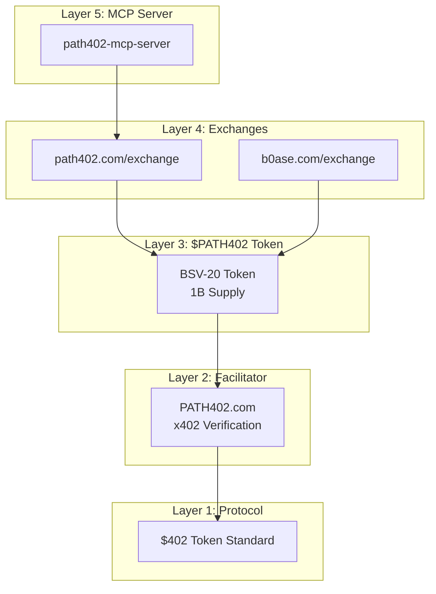
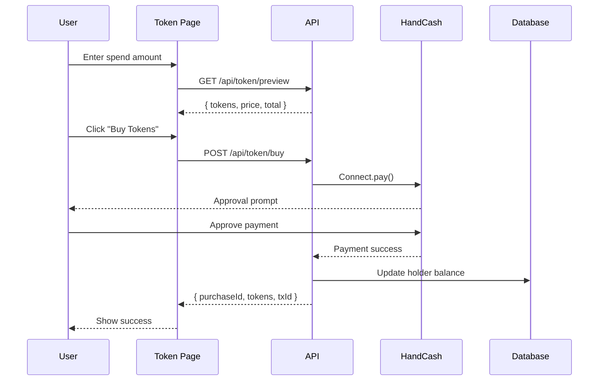
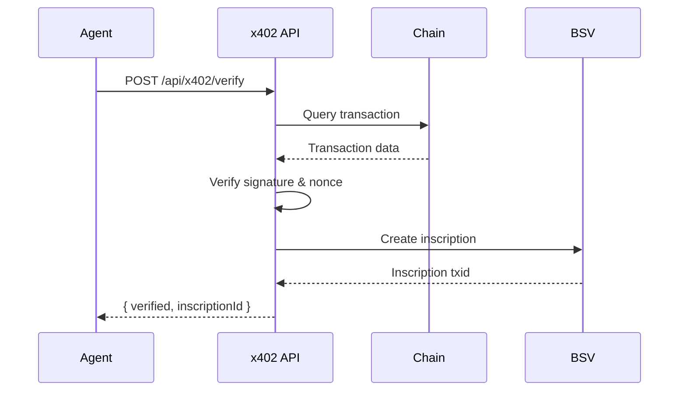

# CODEBASE_MAP.md - path402-com

> Auto-generated by Cartographer. Last mapped: 2026-02-03

## System Overview



**Stack**: Next.js 15.1.0 (App Router), TypeScript, React 18.3, Supabase (self-hosted), HandCash SDK, @bsv/sdk

**Architecture**: Server-rendered pages, 30+ API routes, PostgreSQL database, hybrid wallet support

**Core Innovation**: sqrt_decay pricing model: `price = BASE / √(treasury_remaining + 1)`

---

## Directory Structure

```
path402-com/
├── app/                        # Next.js 15 App Router
│   ├── .well-known/           # Protocol discovery endpoints
│   │   └── x402.json/         # x402 machine-readable endpoint
│   ├── 402/                   # Paywall demo page
│   ├── account/               # User dashboard
│   ├── api/                   # API routes
│   │   ├── account/           # Account derivation
│   │   ├── auth/              # HandCash OAuth
│   │   ├── price/             # BSV price oracle
│   │   ├── stake/             # Staking operations
│   │   ├── token/             # $PATH402 token operations
│   │   ├── tokens/            # Token marketplace (future)
│   │   ├── wallet/            # Wallet registration
│   │   └── x402/              # Facilitator endpoints
│   ├── docs/                  # Documentation page
│   ├── exchange/              # Token marketplace UI
│   ├── registry/              # Cap table / holder registry
│   ├── token/                 # Token trading page
│   └── whitepaper/            # Protocol whitepaper
├── components/                 # React components
│   ├── Navbar.tsx             # Navigation + wallet UI
│   ├── PriceCurveChart.tsx    # sqrt_decay visualization
│   ├── ThemeProvider.tsx      # Dark/light mode
│   └── WalletProvider.tsx     # Wallet context
├── database/                   # Database migrations
│   └── migrations/            # SQL migration files
├── docs/                       # Project documentation
│   ├── $402-STANDARD.md       # Protocol specification
│   ├── ARCHITECTURE.md        # Five-layer architecture
│   ├── BUSINESS_MODEL.md      # Revenue model
│   ├── PRD-TOKEN-CUSTODY-STAKING.md  # Staking PRD
│   └── TOKEN_ARCHITECTURE.md  # Token details
├── lib/                        # Core libraries
│   ├── tokens/                # Token marketplace lib
│   ├── x402/                  # x402 protocol lib
│   ├── address-derivation.ts  # Ordinals address derivation
│   ├── bsv20.ts               # BSV-20 operations
│   ├── bsv20-transfer.ts      # Token transfers
│   ├── store.ts               # Database layer
│   ├── types.ts               # TypeScript types
│   └── x402.ts                # x402 facilitator
├── public/                     # Static assets
└── scripts/                    # Utility scripts
```

---

## Module Guide

### Pages (app/)

| File | Purpose | Tokens |
|------|---------|--------|
| page.tsx | Homepage - protocol overview, features, Quick Start | 3,645 |
| token/page.tsx | Token trading - buy/stake/withdraw, sqrt_decay chart | 8,244 |
| whitepaper/page.tsx | Academic whitepaper, print-optimized | 7,710 |
| account/page.tsx | User dashboard - holdings, derived address | 4,338 |
| registry/page.tsx | Cap table - holder registry, on-chain sync | 4,218 |
| docs/page.tsx | Documentation - MCP tools, pricing models | 3,989 |
| exchange/page.tsx | Token marketplace, example tokens | 2,230 |
| 402/page.tsx | Paywall demo - single-click purchase | 1,574 |

### API Routes - Authentication (app/api/auth/)

| Route | Method | Purpose |
|-------|--------|---------|
| handcash/route.ts | GET | Initiate HandCash OAuth |
| callback/handcash/route.ts | GET | OAuth callback, create session |
| session/route.ts | GET | Check auth status via cookies |
| logout/route.ts | POST | Clear session cookies |
| sign/route.ts | POST | Sign message via HandCash |

### API Routes - Token (app/api/token/)

| Route | Method | Purpose |
|-------|--------|---------|
| buy/route.ts | POST | Purchase tokens (sqrt_decay pricing) |
| price/route.ts | GET | Price schedule and quotes |
| stats/route.ts | GET | Market statistics |
| preview/route.ts | GET | Purchase preview calculation |
| holding/route.ts | GET | User balance and staking |
| withdraw/route.ts | POST | Withdraw to ordinals address |
| cap-table/route.ts | GET | Holder breakdown |
| onchain/route.ts | GET | Blockchain sync status |
| confirm/route.ts | POST | Confirm Yours Wallet payment |

### API Routes - x402 Facilitator (app/api/x402/)

| Route | Method | Purpose |
|-------|--------|---------|
| verify/route.ts | POST | Verify cross-chain payment |
| settle/route.ts | POST | Settle on destination chain |
| inscription/route.ts | POST | Create BSV proof inscription |
| stats/route.ts | GET | Facilitator statistics |

### Libraries (lib/)

| File | Purpose | Key Exports |
|------|---------|-------------|
| store.ts | Database operations | getOrCreateHolder, processPurchaseImmediate, getTokenStats |
| types.ts | TypeScript types | TokenHolder, TokenPurchase, WalletState, TOKEN_CONFIG |
| x402.ts | x402 facilitator | verifyPayment, createInscription |
| address-derivation.ts | Ordinals addresses | deriveAddress (from HandCash signature) |
| bsv20.ts | BSV-20 operations | Token metadata, inscriptions |
| bsv20-transfer.ts | Token transfers | Transfer ordinals |

### Components (components/)

| File | Purpose |
|------|---------|
| Navbar.tsx | Navigation + wallet connection dropdown |
| WalletProvider.tsx | React Context for wallet state |
| PriceCurveChart.tsx | sqrt_decay price visualization |
| ThemeProvider.tsx | Dark/light mode toggle |

---

## Data Flow

### Token Purchase Flow



### x402 Verification Flow



---

## Conventions

### Naming
- Routes: `app/api/[domain]/[action]/route.ts`
- Pages: `app/[page]/page.tsx`
- Components: PascalCase (`WalletProvider.tsx`)
- Libraries: camelCase (`store.ts`, `x402.ts`)

### Patterns
- **Database**: All via `lib/store.ts`, in-memory fallback if DB unavailable
- **Auth**: Cookie-based sessions (`hc_handle`, `hc_token`)
- **Wallet**: Unified interface via `WalletProvider` context
- **Pricing**: sqrt_decay formula centralized in `buy/route.ts`

### Code Style
- TypeScript strict mode
- Functional components with hooks
- Server Components by default (pages)
- Client Components for interactivity (`"use client"`)

---

## Gotchas

1. **Treasury is DERIVED**: Never update treasury balance directly. It's calculated: `500M - SUM(holder.balance)`

2. **Two Pricing Directions**:
   - Content access: Price DECREASES as supply grows (rewards adoption)
   - Treasury sale: Price INCREASES as supply depletes (rewards early buyers)

3. **Database is Self-Hosted**: Not Supabase cloud. Use SSH:
   ```bash
   ssh hetzner "docker exec supabase-db psql -U postgres -d postgres"
   ```

4. **HandCash Payment Destination**: Use `PAYMENT_ADDRESS` (BSV address), NOT `TREASURY_PAYMAIL` (which sends back to self)

5. **HandCash Note Limit**: `note` field must be ≤25 characters

6. **Yours Wallet Detection**: Browser extension loads slowly. Check `window.yours` after delay.

7. **Two Tokens Exist**:
   - `5bf47d...` = $PATH402 (1B, equity)
   - `7a1d...` = $402 (1B, separate)

---

## Navigation Guide

**To modify pricing formula:**
→ `app/api/token/buy/route.ts:10-56`

**To add a new wallet provider:**
→ `components/WalletProvider.tsx` (add connect/disconnect methods)

**To change database schema:**
→ `database/migrations/` (create new SQL file, run via SSH)

**To modify the token page:**
→ `app/token/page.tsx`

**To add x402 support for new chain:**
→ `lib/x402.ts` (add verify function, update SUPPORTED_ASSETS)

**To understand the protocol:**
→ `docs/$402-STANDARD.md`

**To implement staking:**
→ `docs/PRD-TOKEN-CUSTODY-STAKING.md` (full requirements)

---

## Environment Variables

```bash
# Required
DATABASE_URL=postgresql://...
SUPABASE_URL=https://api.b0ase.com
SUPABASE_ANON_KEY=...
HANDCASH_APP_ID=...
HANDCASH_APP_SECRET=...
TREASURY_ADDRESS=1BrbnQon4uZPSxNwt19ozwtgHPDbgvaeD1
PAYMENT_ADDRESS=1BrbnQon4uZPSxNwt19ozwtgHPDbgvaeD1
NEXT_PUBLIC_APP_URL=https://path402.com
```

---

## API Reference

### Authentication
| Endpoint | Method | Purpose |
|----------|--------|---------|
| `/api/auth/handcash` | GET | Initiate OAuth |
| `/api/auth/callback/handcash` | GET | Complete OAuth |
| `/api/auth/session` | GET | Check session |
| `/api/auth/logout` | POST | Clear session |
| `/api/auth/sign` | POST | Sign message |

### Token Operations
| Endpoint | Method | Purpose |
|----------|--------|---------|
| `/api/token/buy` | POST | Purchase tokens |
| `/api/token/price` | GET | Price info |
| `/api/token/stats` | GET | Market stats |
| `/api/token/preview` | GET | Preview purchase |
| `/api/token/holding` | GET | User balance |
| `/api/token/withdraw` | POST | Withdraw |
| `/api/token/cap-table` | GET | Holder registry |

### x402 Facilitator
| Endpoint | Method | Purpose |
|----------|--------|---------|
| `/api/x402/verify` | POST | Verify payment |
| `/api/x402/settle` | POST | Settle payment |
| `/api/x402/inscription` | POST | Create proof |
| `/api/x402/stats` | GET | Statistics |

### Discovery
| Endpoint | Method | Purpose |
|----------|--------|---------|
| `/.well-known/x402.json` | GET | Protocol discovery |

---

**Document Status**: Complete
**Next Review**: After Phase 1 custody implementation
