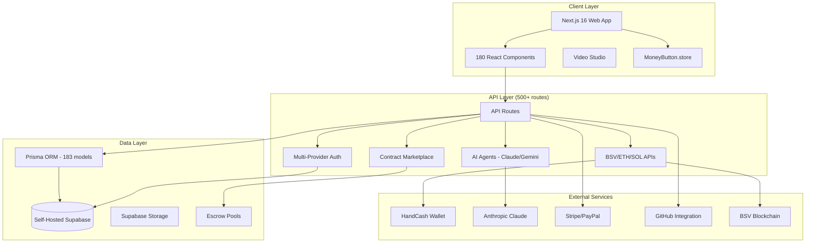
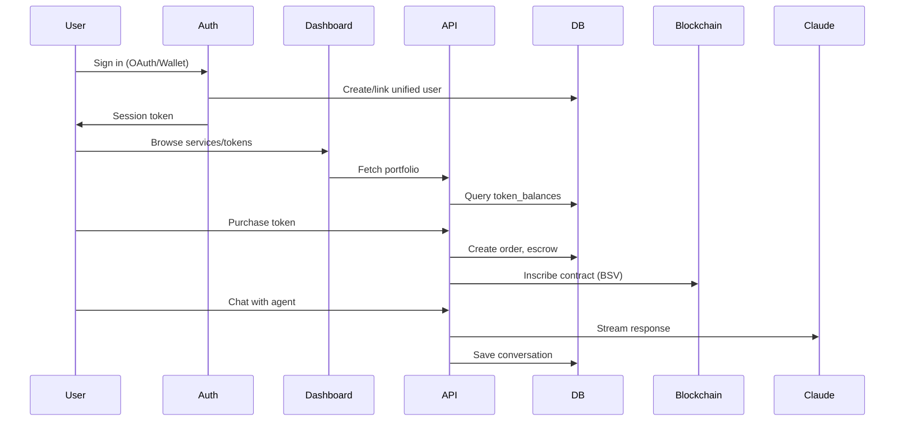

# Codebase Map: b0ase.com

> Auto-generated by Cartographer on January 31, 2026
> **Major Update**: 601 commits since last map - MoneyButton ecosystem, founder escrow pools, developer payouts, token pricing standardization

## System Overview

**b0ase.com** is a full-stack Next.js 16 venture studio platform combining creative services, blockchain functionality, content management, and AI-powered tools. It offers web development services, token launches, marketplace contracts, governance tools, and autonomous AI agent automation.

**Stack**: Next.js 16.1.0 (App Router), TypeScript, React 18.3, Supabase (Auth + PostgreSQL), Prisma ORM (183 models), Tailwind CSS, Framer Motion, Three.js, Web Audio API, Multi-chain blockchain (BSV, ETH, SOL)

**Scale**: 2,045 files | 3.9M tokens | 835 app pages | 500+ API routes | 62 internal packages | 183 database models



## Directory Structure

| Directory | Files | Tokens | Purpose |
|-----------|-------|--------|---------|
| `app/` | 835 | 1,845,397 | Next.js App Router pages and API routes |
| `components/` | 180 | 421,845 | Shared React components |
| `docs/` | 138 | 404,837 | Technical documentation |
| `packages/` | 268 | 268,823 | 62 internal monorepo packages |
| `lib/` | 131 | 251,737 | Core library code |
| `.claude/` | 71 | 174,269 | Claude skills and automation |
| `scripts/` | 117 | 137,336 | Build and utility scripts |
| `content/` | 70 | 124,288 | Blog posts and static content |
| `data/` | 31 | 79,645 | Static data and templates |
| `supabase/` | 54 | 48,703 | Supabase config and migrations |
| `contracts/` | 20 | 28,709 | Smart contract templates |
| `database/` | 12 | 13,354 | Database migrations |
| `prisma/` | 2 | 3,874 | Prisma schema (183 models) |

## API Routes Overview (500+ endpoints)

### Authentication & User Management

#### Auth (`/api/auth/`)
- **Purpose**: Multi-provider OAuth + wallet authentication
- **Endpoints**:
  - `GET/POST /api/auth/google` - Google OAuth flow
  - `GET/POST /api/auth/handcash` - HandCash wallet auth
  - `GET/POST /api/auth/twitter` - Twitter OAuth
  - `GET /api/auth/discord` - Discord OAuth
  - `POST /api/auth/wallet` - MetaMask/Phantom connection
  - `GET /api/auth/me` - Current user
  - `POST /api/auth/logout` - Sign out
- **Auth**: Public for login flows, session required for protected
- **Key imports**: Supabase client, OAuth providers, wallet connectors

#### User (`/api/user/`)
- **Purpose**: Unified user management across auth providers
- **Endpoints**:
  - `GET/PATCH /api/user/unified` - Unified user with linked identities
  - `POST /api/user/merge` - Merge multiple identities
  - `GET/POST /api/user/api-keys` - API key management
  - `GET /api/user/github/repos` - GitHub repositories
  - `GET /api/user/portfolio` - Token portfolio
- **Auth**: Required
- **Pattern**: Links Supabase, HandCash, MetaMask, Twitter, Phantom accounts

### Agent System

#### Agents (`/api/agents/`)
- **Purpose**: Autonomous AI agents with tasks, chat, and blockchain inscription
- **Endpoints**:
  - `POST /api/agents/create` - Create new agent
  - `POST /api/agents/[id]/chat` - Chat with agent (streaming)
  - `GET/POST /api/agents/[id]/tasks` - Scheduled tasks (cron)
  - `GET/POST /api/agents/[id]/inscriptions` - BSV blockchain inscriptions
  - `GET/POST /api/agents/[id]/projects` - Link projects to agents
  - `GET /api/agents/analytics` - Usage analytics
- **Auth**: Required (user owns agents)
- **Task Types**: `tweet`, `blog`, `analysis`, `webhook`, `ai_generate`, `inscription`, `custom`

### Marketplace & Contracts

#### Marketplace (`/api/marketplace/`)
- **Purpose**: Contract-based service marketplace with escrow
- **Endpoints**:
  - `POST /api/marketplace/contracts/create` - Create contract
  - `POST /api/marketplace/contracts/[id]/inscribe` - Inscribe to BSV
  - `POST /api/marketplace/milestones/[id]/submit` - Submit milestone
  - `POST /api/marketplace/milestones/[id]/approve` - Approve milestone
  - `POST /api/marketplace/milestones/[id]/link-pr` - Link GitHub PR
  - `POST /api/marketplace/webhooks/stripe` - Stripe webhook
  - `POST /api/marketplace/webhooks/paypal` - PayPal webhook
- **Auth**: Required (client/developer verification)
- **Pattern**: 50/50 milestone payments, 5% platform fee, escrow-based

### Token System

#### MoneyButton (`/api/moneybutton/`)
- **Purpose**: MoneyButton.store - tradeable buttons on BSV
- **Endpoints**:
  - `POST /api/moneybutton/token/purchase` - Purchase tokens
  - `GET /api/moneybutton/token/balance` - Token balance
  - `GET/POST /api/moneybutton/download/[id]` - Paid downloads
  - `POST /api/moneybutton/download/upload` - Upload for sale
- **Auth**: Required for purchases
- **Pattern**: $0.01 default token price, 95/5 split (project/platform)

#### Tokens (`/api/tokens/`)
- **Purpose**: Hybrid on/off-chain token system
- **Endpoints**:
  - `POST /api/tokens/mint` - Mint tokens
  - `POST /api/tokens/deploy` - Deploy on-chain
  - `GET /api/tokens/balance` - Get balances
  - `GET /api/tokens/members` - Token holders
- **Auth**: Required
- **Pattern**: Database-first with optional on-chain deployment

### Investment & Fundraising

#### Investors (`/api/investors/`)
- **Purpose**: Investment agreements, cap table, vaults
- **Endpoints**:
  - `POST /api/investors/register` - Register as investor
  - `POST /api/investors/create-vault` - Create 2-of-2 multisig vault
  - `GET/POST /api/investors/agreements` - Investment agreements
  - `POST /api/investors/agreements/[id]/clawback` - Trigger clawback
  - `GET /api/investors/cap-table` - Cap table view
  - `POST /api/investors/purchase/initiate` - Start token purchase
- **Auth**: Required (KYC verification for some operations)

#### Kintsugi Pipeline (`/api/pipeline/`)
- **Purpose**: Triage system connecting investors → work items → developers → payouts
- **Endpoints**:
  - `GET /api/pipeline` - API documentation and health check
  - `POST /api/pipeline/create-project` - Create project in pipeline
  - `POST /api/pipeline/create-issue` - Create work item with bounty
  - `GET /api/pipeline/create-issue` - List open work items
  - `POST /api/pipeline/claim-issue` - Claim/start/submit/release work
  - `GET /api/pipeline/claim-issue` - Developer's claimed items
  - `POST /api/pipeline/complete-issue` - Approve and trigger payout
  - `GET /api/pipeline/complete-issue` - Project pipeline stats
  - `GET /api/pipeline/work-items` - Browse all work items
- **Auth**: Required for mutations, public for listings
- **Pattern**: Funding tranche → work items → developer claims → escrow payout
- **Library**: `lib/pipeline-manager.ts` - Core business logic

### Content Management

#### Blog (`/api/blog/`)
- **Purpose**: AI-generated and manual blog posts
- **Endpoints**:
  - `POST /api/blog/generate` - Generate via Gemini AI
  - `GET /api/blog/list` - Published posts
  - `POST /api/blog/inscribe` - Inscribe to BSV
- **Auth**: Required for generation/inscription
- **Pattern**: H2-only headings enforced

### Cron Jobs (`/api/cron/`)
- **Purpose**: Scheduled task execution (Vercel Cron)
- **Jobs**: Agent tasks (every min), blog (daily 2PM), Twitter (daily 10AM), book (weekly), backups (daily 3AM), dividends (daily midnight)
- **Auth**: CRON_SECRET header

## Key Features by Section

### Dashboard (`/app/dashboard/`)
**17+ modules** for project management:
- **Agents** - AI agent management with chat, tasks, analytics
- **Auto-Book** - High-frequency book publishing automation
- **Contracts** - Service contracts with milestone tracking
- **Finances** - Financial tracking and accounts
- **Fundraising** - Investment pitch deck (£1.5M raise, 3% equity)
- **Servers/Hetzner** - Self-hosted infrastructure monitoring
- **Developer Setup** - 5-step onboarding wizard

### MoneyButton (`/app/moneybutton/`)
**Purpose**: Flagship micropayment and tokenization system
- **Dashboard** - 30 MoneyButtons across 5 categories (Payments, Social, Creator, Gaming, Media)
- **Create** - Custom MoneyButton builder
- **Buy/Upload** - File marketplace with BSV payments
- **Token Standard**: $0.01 per token, 95/5 revenue split

### Tokens (`/app/tokens/`)
- **Physics Engine** - Interactive token visualization with collision detection
- **9 Token Categories**: Identity, Social, Governance, NFTs, Revenue, Legal, Data, Utility, Conversation
- **Registry**: 80+ tokens (6 minted, 70+ concept)

### Gigs & Contracts (`/app/gigs/`, `/app/contracts/`)
- **Gig Marketplace** - Offered/wanted job listings
- **117 Service Contracts** - Fixed-price development contracts
- **Multi-chain Support** - BSV, ETH, SOL deployment options
- **Escrow System** - Smart contract escrow with milestone payments

### Mint (`/app/mint/`)
**4 Tokenization Modes**:
1. **Repository** - GitHub repos → BSV-20 tokens (3-tier verification)
2. **Developer** - Developer reputation tokens
3. **Project** - Portfolio project tokens
4. **Company** - Equity tokenization (FCA compliant)

**Pricing Curves**: Linear, Exponential, Logarithmic, Sigmoid

### Investors (`/app/investors/`)
- **KYC Verification** - Required for staking/dividends
- **2-of-2 Multisig** - Investor token custody
- **$BOASE Token** - £200k FDV, 100B supply, 100% founder-held

### Pipeline (`/app/pipeline/`)
**5 Funding Phases**:
1. **Concept** ($0) - Idea validation
2. **Seed** ($10K) - Token launch & MVP
3. **Build** ($50K) - Full development
4. **Launch** ($100K) - Public release
5. **Scale** ($250K) - Team expansion

## Core Library (`/lib/`)

### Authentication (`lib/auth/`)
- `isAdmin(authUserId)` - Admin verification
- `verifyApiKey(apiKey)` - `b0_` prefixed API keys (SHA-256 hashed)
- `createMergeToken(payload)` - JWT for account merging

### Database
- `lib/database/pool.ts` - Shared pg.Pool (20 connections, 30s idle timeout)
- `lib/prisma.ts` - Lazy Prisma client with BigInt serialization
- `lib/supabase/client.ts` - Browser client with demo mode
- `lib/supabase/server.ts` - Server client with OAuth cookie handling

### Blockchain
- `lib/bsv-inscription.ts` - BSV 1Sat Ordinal inscriptions
- `lib/handcash-service.ts` - HandCash wallet integration
- `lib/multichain.ts` - Aggregate holdings across BSV/ETH/SOL

### Agent System
- `lib/agent-executor.ts` - Task execution engine (7 task types)
- `lib/agent-inscription.ts` - BSV inscription for agent outputs

### Payments
- `lib/pricing.ts` - 1/3-1/3-1/3 payment structure with 25% margin
- `lib/token-registry.ts` - 80+ token metadata registry
- `lib/token-pricing.ts` - Token price calculations
- `lib/escrow-manager.ts` - Unified escrow across Stripe/PayPal/crypto
- `lib/pipeline-manager.ts` - Kintsugi triage work item management

## Components (`/components/`)

### Organization
- `components/ui/` - shadcn/ui design system (Button, Card, Badge, Input, Tabs)
- `components/blog/` - Blog rendering (BlogContent with H2-only enforcement)
- `components/token/` - Token cards (SolanaCard, BitcoinSvCard, EthereumCard)
- `components/marketplace/` - Marketplace onboarding
- `components/agents/` - Agent management UI

### Provider Stack (`Providers.tsx`)
```typescript
<ThemeProvider>
  <DesignPillarProvider>
    <AuthContext.Provider>
      <SimpleCartProvider>
        {children}
      </SimpleCartProvider>
    </AuthContext.Provider>
  </DesignPillarProvider>
</ThemeProvider>
```

## Infrastructure

### Packages (`/packages/`) - 62 Internal Packages

**Blockchain & Wallets** (13):
- `@b0ase/handcash` - HandCash OAuth (server + client + React provider)
- `@b0ase/multi-wallet-auth` - Unified multi-chain wallet auth
- `@b0ase/bitcoin-signing` - BSV transaction signing
- `@b0ase/whatsonchain` - WhatsOnChain API client

**Token Economics** (8):
- `@b0ase/bonding-curve` - Exponential, linear, sigmoid curves
- `@b0ase/dividend-engine` - Shareholder dividend distribution
- `@b0ase/governance` - Token voting
- `@b0ase/ledger` - Unified 1Sat + BRC-100 accounting

**UI Components** (10):
- `@b0ase/flow-canvas` - Visual flow diagrams
- `@b0ase/shareholder-ui` - Cap table UI
- `@b0ase/tokenization-modal` - Token creation modal

### Database (`/supabase/`, `/database/`, `/prisma/`)

**Supabase Config** (`config.toml`):
- Project ID: `b0ase.com`
- Database: PostgreSQL 17 (self-hosted on Hetzner)
- OAuth: Google, Twitter, Discord, GitHub, LinkedIn
- Rate Limits: 30/5min sign in, 150/5min token refresh

**Key Migrations** (30+):
- `20260115000000_create_agent_system.sql` (23KB) - Agent tables, tasks, memory
- `20260115100000_create_pipeline_system.sql` (18KB) - Contract pipeline
- `20260116000001_create_tokenized_repositories.sql` - Repo tokenization

**Prisma Schema**: 183 models across auth and public schemas

### Scripts (`/scripts/`) - 100+ Utilities
- `apply-migration-to-server.sh` - Production migration via SSH
- `sync-github-issues.ts` - Sync 22 repos to funding tranches
- `generate-tweet.ts` - AI tweet generation
- `setup-dev-environment.sh` - Complete dev setup (5,237 lines)

### Contract Templates (`/contracts/`) - 20 Templates
- Web Design: `landing-page.md` (£180), `ecommerce-store.md`
- Blockchain: `bsv-token-deployment.md`, `handcash-integration.md`
- Content: `crypto-whitepaper.md`, `ai-agent-custom.md`

## Content & Documentation

### Blog (`/content/blog/`) - 62 Posts
**Topics**: AI agents, blockchain, tokens, development, business
**Rule**: H2-only headings (CRITICAL - enforced via blog-formatter skill)
**Pattern**: Human content first, AI metadata section at end

### Documentation (`/docs/`) - 105 Files
**Key Docs**:
- `DOC_INDEX.md` - Master index (80% health score)
- `AGENT_SYSTEM_SPEC.md` (49,111 lines) - Agent architecture
- `CONTRACT_MARKETPLACE_ARCHITECTURE.md` (30,643 lines) - Marketplace design
- `ECOSYSTEM_MAP.md` (343,830 lines) - Complete ecosystem mapping

### Data (`/data/`)
- `cashboard/templates.ts` (62,289 lines) - Organization, role, agent templates
- `workflows/` - 12 complete business workflows (AI, DeFi, e-commerce)

## Configuration

### `package.json`
- **Framework**: Next.js 16.1.0, React 18.3.1
- **AI**: @anthropic-ai/sdk, @google/generative-ai, openai
- **Blockchain**: @bsv/sdk 1.9.31, ethers 6.16.0, @solana/web3.js
- **Package Manager**: pnpm (CRITICAL - never use npm/yarn)

### `next.config.js`
- **Security Headers**: HSTS, X-Frame-Options, CSP
- **Image Optimization**: WebP/AVIF, 8 device sizes
- **Bundle Splitting**: three-vendor, supabase-vendor, common-vendor chunks

### `vercel.json` - 10 Cron Jobs
1. Agent Tasks (every minute)
2. Twitter Post (daily 10AM)
3. Blog Post (daily 2PM)
4. Weekly Book (Sunday 2AM)
5. Database Backup (daily 3AM)
6. $bWriter Dividends (daily midnight)

## Data Flow



## Key Patterns

### 1. Multi-Provider Authentication
- Supabase Auth (OAuth, magic links)
- Wallet auth (HandCash, MetaMask, Phantom)
- API keys (`b0_` prefix, SHA-256 hashed)
- Unified user linking across providers

### 2. Payment Structure
- 1/3-1/3-1/3 (Deposit → Delivery → Final)
- 25% margin protection
- Escrow-based milestones
- Stripe + PayPal + Crypto (BSV)

### 3. Token Economics
- BSV-20 standard (primary)
- Bonding curves (4 types)
- 2-of-2 multisig custody
- Dividend distribution engine

### 4. Agent Automation
- 7 task types with cron scheduling
- Project linking with permissions
- BSV blockchain inscription
- Claude API with streaming

### 5. Demo Mode
- Graceful degradation without credentials
- Mock clients for development
- Clear error messages

## Security Considerations

- **API Keys**: SHA-256 hashed, never plaintext
- **Admin Access**: Email-based verification
- **Supabase RLS**: Row-level security policies
- **Private Keys**: Environment variables only
- **CORS**: OAuth cookies use `sameSite: 'lax'`

## Navigation Guide

**To add a new API endpoint**:
1. Create `app/api/[group]/[endpoint]/route.ts`
2. Add Zod input validation
3. Add authentication check
4. Run security scan

**To add a new token**:
1. Add to `TOKEN_REGISTRY` in `lib/token-registry.ts`
2. Deploy on BSV (store `tokenId` and `txid`)
3. Update pricing when minted

**To add a new service**:
1. Add to `services` array in `lib/services.ts`
2. Create detail page at `/app/services/[id]/page.tsx`

**To create an agent**:
1. `POST /api/agents/create`
2. Add tasks via `POST /api/agents/[id]/tasks`
3. Schedule with cron or manual trigger

**To inscribe content on BSV**:
1. Fund BSV address (get UTXOs)
2. Call `inscribeContract()` or `inscribeAndSaveAgentOutput()`
3. Store returned `txid` in database

---

**Last Mapped**: 2026-01-31T12:00:00Z
**Total Files**: 2,045
**Total Tokens**: 3,929,376
**Commits Since Last Map**: 601
